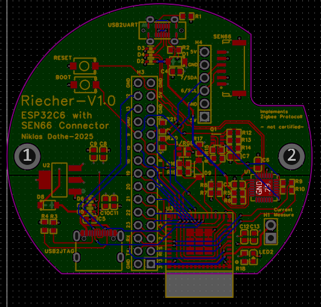

# Riecher
## motivation
While Puster focuses on cleaning indoor air, Riecher focuses on understanding it.
It was developed to better understand and improve indoor air quality. Key indicators such as temperature, humidity, particulate matter (PM2.5, PM10), VOCs, NOx, and CO₂ are essential for understanding both health and comfort.

Poor air quality can trigger allergies or asthma and directly impact well-being and productivity. In particular, CO₂ concentration is closely linked to our ability to concentrate, a critical factor in work and learning environments.  

What I understand of good IAQ metrics after doing some research:

| Parameter         | Very Good (Ideal)         | Good (No Changes Needed)    | Moderate (Changes Can Be Made) | Bad (Changes Needed)       | Very Bad (Leave – Health Risk)     |
|------------------|----------------------------|------------------------------|----------------------------------|------------------------------|--------------------------------------|
| **PM2.5 (µg/m³)** | ≤ 10 – clean air           | 11–20 – low risk             | 21–25 – minor effects possible  | 26–50 – unhealthy levels     | > 50 – hazardous (lung/cardiac impact) |
| **PM10 (µg/m³)**  | ≤ 20 – background level    | 21–35 – acceptable           | 36–50 – WHO daily limit         | 51–100 – high exposure       | > 100 – severe pollution              |
| **VOC Index**     | < 50 – odorless, clean     | 50–100 – typical indoor air  | 101–250 – noticeable VOCs       | 251–400 – irritants likely   | > 400 – unhealthy, strong emissions  |
| **NOx Index**     | 1–25 – fresh air           | 26–50 – minimal NOx          | 51–100 – minor combustion sources | 101–300 – respiratory risk   | > 300 – toxic, strong pollution       |
| **CO₂ (ppm)**     | ≤ 800 – excellent air      | 801–1000 – good              | 1001–2000 – drowsiness risk     | 2001–5000 – discomfort, headache | > 5000 – unsafe, leave immediately |
| **Humidity (%RH)** | 40–50 – optimal range     | 30–60 – comfortable          | 20–30 / 60–70 – dry/humid edge  | 10–20 / 70–80 – health/mold risk | <10 / >80 – extreme, unsafe         |

> Based on WHO, EPA, UBA, ASHRAE, and Sensirion guidelines.

By monitoring these values in real time, Riecher provides insights that help create healthier, safer, and more focused living and working spaces.

## mechanicals
 
### parts list
- **1x base**  
  3D printed or machined. Holds the main assembly.  
    
- **1x cage**   
  Provides airflow and mechanical protection for the sensors.   
    
- **1x lid**  
  screw on lid for easy maintenance.  
    
- **1x ESP32 based pcb**   
  Integrates the SEN66 air quality sensor.  
    
- **SEN66**  
  At the heart of this product sits the SEN66 AirQuality Sensor by Sensirion. This sensor gives us all the relevant metrics in one package.
    
- **connection cable**  
  TODO (accurate bezeichnung)
- _x screws
  TODO (heat set inserts)

### manufacturing
The ***base*** was routed from wood using a cnc machine. This was a dual sided operation as it has features on both sides of the base. On the bottom there is a place for the cable to be routed which acts as a strain relief at the same time.

The ***cage*** was printed with Bambu Labs wood filament.'

## electronics
### the pcb 
you can order the pcb through the following link:  
https://aisler.net/p/XLGCRZIT  
i added a stencil to help me with assembly.

the ESP32-C6 was chosen as the core of the Riecher PCB because it offers modern wireless connectivity while staying flexible for different smart home ecosystems. with support for Wi-Fi 6, Bluetooth Low Energy 5.0, Zigbee and Thread (Matter), it can easily integrate into existing setups, whether that’s a Zigbee network, Matter-over-Thread, or simple Wi-Fi control. this makes the device adaptable for the future without locking it to one protocol.

I brought out the full GPIO Header known from the ESP32 Devkits which allows the Puster to be extended to your liking. 
 
   

## FAQ

  
How do the NOx and VOCx scales work?

  

